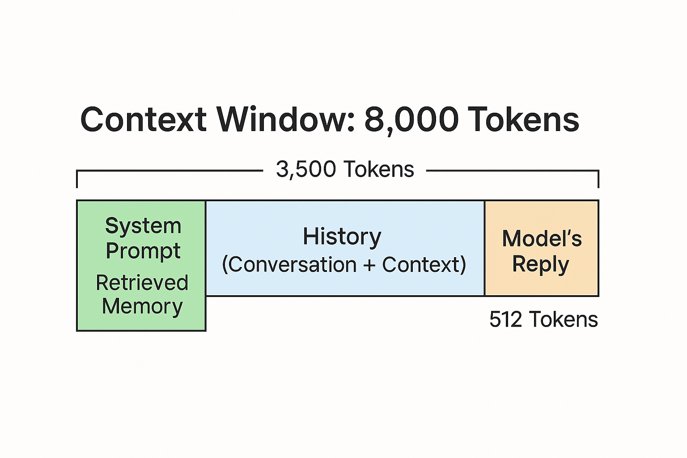

## Sliding Window Technique in NLP and LLMs

The **sliding window** is a method for processing sequences by moving a fixed-size window across data, one step at a time. In natural language processing (NLP) and large language models (LLMs), this technique helps manage texts longer than the model's maximum token limit.

- **Context Management:** Breaks long documents into overlapping chunks that fit within the model's token limit.
- **Information Retention:** Overlapping windows preserve context between chunks, minimizing information loss.
- **Efficient Processing:** Enables sequential or batch processing of large inputs without exceeding memory or model constraints.



### How Sliding Window Works

Suppose your model can handle up to **100 tokens** at once, but your document is **250 tokens** long. You can use a sliding window to create overlapping chunks:

- **Window size:** 100 tokens
- **Step size:** 50 tokens (50-token overlap)

**Chunk breakdown:**

- Chunk 1: tokens 0–99
- Chunk 2: tokens 50–149
- Chunk 3: tokens 100–199
- Chunk 4: tokens 150–249

This approach ensures each chunk fits the model's limit and maintains context between chunks.

```python
text = "...your long text..."  # Assume this is tokenized as a list of tokens
tokens = text.split()         # Example tokenization
window_size = 100
step_size = 50
chunks = []

for start in range(0, len(tokens), step_size):
    end = start + window_size
    chunk = tokens[start:end]
    if chunk:
        chunks.append(chunk)

for i, chunk in enumerate(chunks):
    print(f"Chunk {i+1}:", chunk)

----

**Explanation:**

- The loop moves the window by `step_size` each time.
- Each chunk contains up to `window_size` tokens.
- Overlap ensures context continuity.

```

### Common Applications

- Summarizing long documents
- Building context-aware chatbots
- Retrieving information from large texts
- Managing memory in LLM agents

**Summary:**  
The sliding window technique is essential for handling long texts in NLP and LLMs. It enables efficient processing while preserving important context, making it a practical solution for many real-world tasks.
