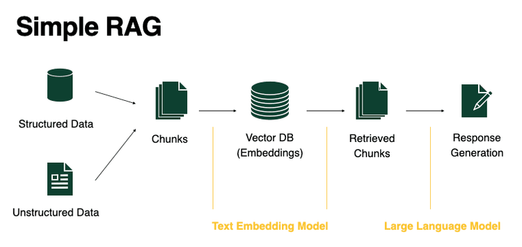

## Retrieval-Augmented Generation (RAG)

Retrieval-Augmented Generation (RAG) is an advanced technique in natural language processing (NLP) that combines the strengths of retrieval-based models and generative models to produce more accurate, context-aware, and informative responses.

RAG integrates two main components and processes:

1. **Document Ingestion and Chunking**: Source documents are ingested and split into smaller, manageable chunks. Each chunk is converted into a vector representation using an embedding model and stored in a vector database for efficient retrieval.

2. **Retriever**: When a user submits a query, the retriever searches the vector database to find the most relevant document chunks based on semantic similarity.

### Detailed RAG Workflow

1. **Chunking**: The process begins by converting your structured or unstructured dataset into text documents. These documents are then broken down into smaller, manageable pieces called chunks. Chunking helps ensure that relevant information can be efficiently retrieved and processed.

2. **Embedding Documents**: Each chunk is transformed into a dense vector using a text embedding model (such as Sentence Transformers or OpenAI embeddings). These vectors capture the semantic meaning of the text, enabling similarity-based retrieval.

3. **Storing in Vector Database**: The generated embeddings are stored in a vector database (e.g., FAISS, ChromaDB). This database allows for fast and efficient similarity searches, forming the backbone of the retrieval process.

4. **Retrieval**: When a user submits a query, the system converts the query into an embedding and searches the vector database for the most relevant chunks. This step ensures that only the most pertinent information is selected for response generation.

5. **Augmentation**: The retrieved chunks are passed to the language model as additional context, augmenting the original query with external knowledge.

6. **Response Generation**: The language model (LLM) synthesizes the retrieved information and the user’s query to generate a coherent, context-aware, and informative response.

This workflow enables RAG systems to leverage both the breadth of external knowledge and the generative capabilities of large language models, resulting in more accurate and contextually grounded outputs.

### Benefits of RAG

- **Enhanced Factual Accuracy**: RAG grounds generated responses in retrieved external documents, reducing the risk of hallucinations and improving the reliability of answers.
- **Access to Current Information**: By retrieving data from external sources, RAG systems can provide up-to-date responses, overcoming the limitations of models trained on static datasets.
- **Transparent Reasoning**: The system can reference the specific documents used to generate a response, increasing explainability and user trust.
- **Scalability**: RAG can efficiently handle large and diverse knowledge bases, making it suitable for enterprise and research applications.
- **Domain Adaptability**: By updating or changing the underlying document store, RAG systems can be quickly adapted to new domains or specialized tasks.
- **Improved Contextual Understanding**: Combining retrieval with generation allows RAG to produce more context-aware and relevant answers, especially for complex queries.
- **Efficient Knowledge Integration**: RAG enables seamless integration of structured and unstructured data sources, broadening the scope of information available for response generation.

### Key Technologies

- **Vector Databases**: Enable fast similarity search and retrieval of relevant document chunks (e.g., FAISS, ChromaDB).
- **Embedding Models**: Transform text into dense vector representations for semantic search (e.g., Sentence Transformers, OpenAI embeddings).
- **Large Language Models (LLMs)**: Generate context-aware responses using retrieved information (e.g., GPT-4, T5).
- **Re-ranking Models**: After initial retrieval, re-ranking models (such as cross-encoders) score and sort the retrieved chunks to ensure the most relevant information is prioritized for generation.
- **Retrieval Pipelines**: Combine multiple retrieval and ranking steps to optimize the selection of supporting documents.
- **Document Chunking Tools**: Automate the splitting of large documents into manageable, retrievable pieces.

### Common Challenges

- **Retrieval Relevance**: The effectiveness of RAG depends on how accurately the system retrieves relevant documents or chunks.
- **Limited Context Window**: Language models can only process a finite amount of retrieved text, which may restrict the amount of supporting information.
- **System Latency**: The retrieval and generation steps introduce additional computational time, potentially impacting response speed.

### RAG Frameworks and Libraries

Widely used tools for implementing RAG systems include:
- **LangChain**: Modular framework for building retrieval-augmented applications.
- **Haystack**: Open-source toolkit for developing search and question-answering systems.
- **Hugging Face Transformers (RAG model)**: Pre-built models and utilities for integrating retrieval with generation.

RAG enables the development of intelligent applications that blend generative AI with reliable retrieval, making it well-suited for tasks requiring accurate and context-rich responses.
